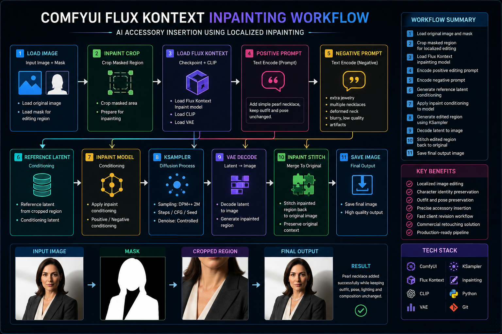
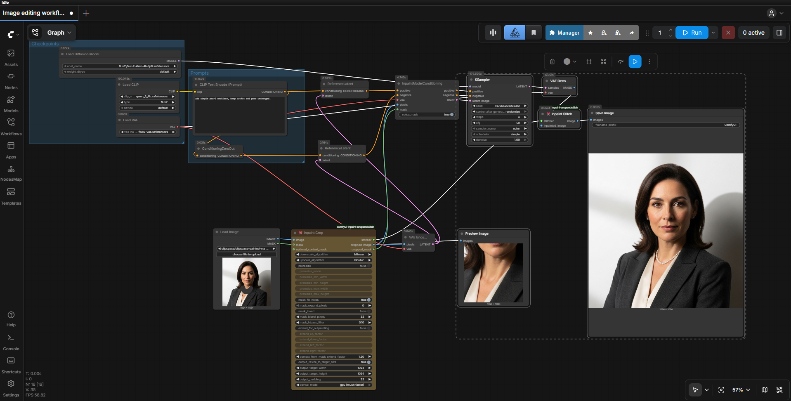
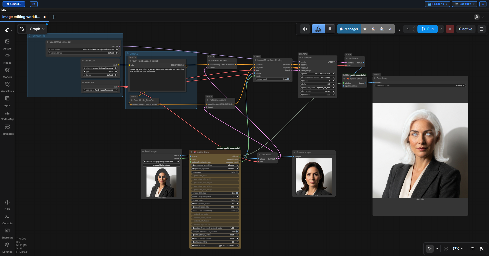

# README.md

# AI Accessory Insertion using ComfyUI Inpainting

A production-oriented ComfyUI workflow designed to perform localized image editing using AI Inpainting.

This project demonstrates how Generative AI can be used to add accessories to existing imagery while preserving character identity, clothing, pose, lighting, and composition.

---

## Project Overview

This workflow was developed to solve a common commercial image editing requirement.

### Original Request

Add a simple pearl necklace to a professional office woman while preserving:

* Outfit
* Pose
* Facial features
* Lighting
* Composition

### Solution

A targeted mask was created around the neck area and an inpainting workflow was used to generate the necklace without affecting the surrounding image.

---

## Architecture Diagram

---

## Workflow Graph

---

## Sample Outputs

### Original Image

### Final Output

---
## Workflow -02 Graph

---
## Sample Outputs

### Original Image

### Final Output

---

## Workflow Structure

Input Image
↓
Mask Creation
↓
Load Inpaint Model
↓
Positive Prompt
↓
Negative Prompt
↓
Inpaint Conditioning
↓
KSampler
↓
VAE Decode
↓
Save Image

---

## Prompt Used

Add simple pearl necklace,
keep outfit unchanged,
keep pose unchanged,
professional office woman,
natural appearance

---

## Technical Stack

| Category        | Technology      |
| --------------- | --------------- |
| Workflow Engine | ComfyUI         |
| Base Model      | SDXL Inpainting |
| Editing Method  | AI Inpainting   |
| Sampling        | DPM++ 2M SDE    |
| Scheduler       | Karras          |
| Programming     | Python          |
| Version Control | Git             |

---

## Documentation

| Document                                            | Description                                 |
| --------------------------------------------------- | ------------------------------------------- |
| 📘 [Node Explanations](docs/node_explanations.md)   | Detailed explanation of workflow nodes      |
| 📗 [Optimization Notes](docs/optimization_notes.md) | Workflow testing and optimization decisions |

---

## Learning Objectives

* AI Inpainting
* Localized Image Editing
* Mask Conditioning
* Prompt Guided Editing
* Commercial Image Retouching
* Production Workflow Design

---

## Future Improvements

* Product Placement Workflows
* Jewelry Replacement System
* Multi-Mask Editing
* Fashion Editing Pipelines
* Brand Logo Replacement

---

## Author

Gowtham Subramanian

Generative AI Workflow Designer | Technical Artist | Senior Digital Compositor
